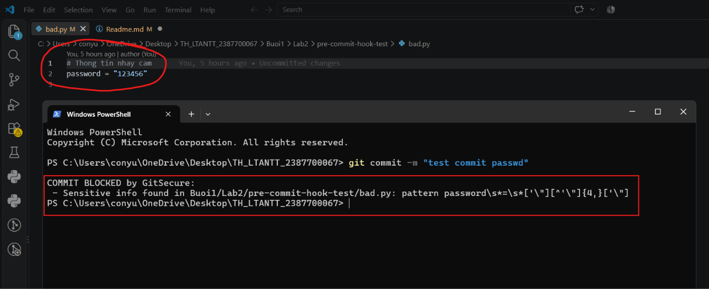
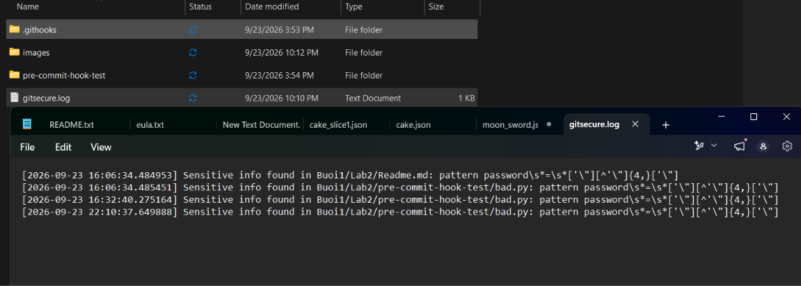
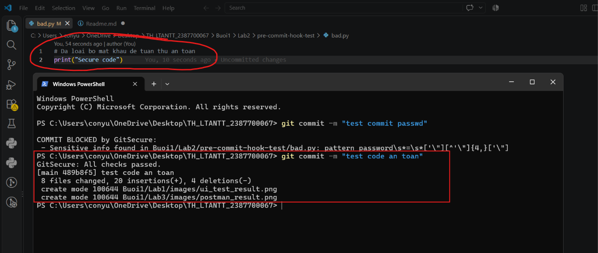

# BÁO CÁO THỰC HÀNH LAB 2: BẢO MẬT TRƯỚC KHI COMMIT (GIT SECURITY VÀ PRE-COMMIT HOOKS)

---

## 1. THÔNG TIN BÀI BÁO CÁO
- **Môn học**: Thực hành Lập trình An ninh Thông tin (TH_LTANTT)
- **MSSV**: 2387700067
- **Họ và tên**: Đặng Hải Tiến
- **Bài thực hành**: Lab 2 (Mục 1.4: Bảo mật trước khi commit - Hệ thống GitSecure Hook)

---

## 2. MỤC TIÊU VÀ Ý NGHĨA
Trong quy trình phát triển phần mềm an toàn (**DevSecOps**), việc kiểm tra an ninh sớm ngay tại máy của lập trình viên (nguyên lý **Shift-Left Security**) đóng vai trò quyết định nhằm ngăn chặn thông tin nhạy cảm và mã độc lọt vào kho lưu trữ (repository) trước khi được đẩy lên máy chủ.

**Hệ thống GitSecure Pre-commit Hook** được xây dựng nhằm đáp ứng các yêu cầu:
1. **Quét thông tin nhạy cảm (Secret Scanning)**: Nhận diện tự động các thông tin xác thực bị cài cứng (hardcoded) như `apikey`, `secret`, `password`, `token`, và khóa truy cập đám mây AWS (`AKIA/ASIA`).
2. **Phân tích mã nguồn tĩnh (SAST)**: Tích hợp công cụ **Bandit** (`bandit -r .`) để quét các lỗ hổng mã nguồn Python ở mức độ nghiêm trọng cao (**High severity**).
3. **Kiểm tra quyền truy cập file (Permissions Check)**: Đảm bảo các tệp không bị cấp quyền ghi quá thoáng (**world-writable - 777**), có xử lý tương thích môi trường Windows.
4. **Ghi nhật ký kiểm toán (Audit Logging)**: Tự động ghi lại các phát hiện kèm dấu thời gian vào tệp `gitsecure.log`.
5. **Chặn commit tự động (Enforcement)**: Lập tức từ chối lệnh commit (`exit(1)`) nếu phát hiện bất kỳ vi phạm nào.

---

## 3. CẤU TRÚC DỰ ÁN LAB 2
```text
Lab2/
├── Readme.md                       # Báo cáo thực hành chi tiết & hình ảnh minh chứng
├── requirements.txt                # Khai báo công cụ phân tích bảo mật (bandit)
├── gitsecure.log                   # Tệp nhật ký ghi lại các lần vi phạm an toàn
├── images/                         # Thư mục lưu trữ hình ảnh minh chứng thực nghiệm
│   ├── case1_blocked.png           # Case 1: Chặn commit khi phát hiện hardcoded password
│   ├── case2_log.png               # Case 2: Kiểm tra nhật ký vi phạm trong gitsecure.log
│   └── case3_passed.png            # Case 3: Xử lý an toàn và commit thành công
├── .githooks/
│   └── pre-commit                  # Script Python thực thi quy trình kiểm tra bảo mật
└── pre-commit-hook-test/
    └── bad.py                      # Tệp mã nguồn kiểm thử
```

---

## 4. HƯỚNG DẪN CÀI ĐẶT VÀ KÍCH HOẠT HOOK
1. Cài đặt công cụ phân tích mã tĩnh **Bandit**:
   ```powershell
   pip install -r requirements.txt
   ```
2. Kích hoạt thư mục Git Hook tùy chỉnh cho repository:
   ```powershell
   git config core.hooksPath Buoi1/Lab2/.githooks
   ```

---

## 5. KẾT QUẢ THỰC NGHIỆM VÀ CÁC CA KIỂM THỬ (TEST CASES)

### 📸 Ca kiểm thử 1 (Case 1): Tự động phát hiện thông tin nhạy cảm và Chặn Commit
- **Tình huống giả định**: Trong tệp `pre-commit-hook-test/bad.py`, lập trình viên vô tình gán cứng thông tin mật khẩu dưới dạng chuỗi biến `password`:
  ```python
  # Thong tin nhay cam
  password = "..."
  ```
- **Thao tác thực hiện**:
  ```powershell
  git commit -m "test commit passwd"
  ```
- **Kết quả thực tế**:
  Hệ thống GitSecure tự động kích hoạt trước khi commit, quét tệp được stage trong Git Index, đối sánh với biểu thức chính quy `password\s*=\s*['\"][^'\"]{4,}['\"]`. Hook đã phát hiện chuỗi vi phạm và **lập tức chặn đứng thao tác commit (`COMMIT BLOCKED by GitSecure`)**.
- **Hình ảnh minh chứng thực tế**:
  

---

### 📸 Ca kiểm thử 2 (Case 2): Kiểm tra nhật ký ghi nhận vi phạm trong `gitsecure.log`
- **Mô tả**: Để phục vụ công tác giám sát và kiểm toán an toàn thông tin, hệ thống tự động ghi lại chi tiết thời gian và mẫu vi phạm vào file nhật ký `gitsecure.log`.
- **Thao tác thực hiện**: Mở file `Buoi1/Lab2/gitsecure.log` để kiểm tra.
- **Kết quả thực tế**:
  Nhật ký ghi lại chính xác thời gian thực tế xảy ra vi phạm:
  ```text
  [2026-09-23 22:10:37.649888] Sensitive info found in Buoi1/Lab2/pre-commit-hook-test/bad.py: pattern password\s*=\s*['\"][^'\"]{4,}['\"]
  ```
- **Hình ảnh minh chứng thực tế**:
  

---

### 📸 Ca kiểm thử 3 (Case 3): Khắc phục mã nguồn và Commit thành công
- **Mô tả**: Sau khi nhận được cảnh báo từ GitSecure, lập trình viên tiến hành chỉnh sửa mã nguồn bằng cách loại bỏ hoàn toàn mật khẩu gán cứng trong tệp `bad.py`:
  ```python
  # Da loai bo mat khau de tuan thu an toan
  print("Secure code")
  ```
- **Thao tác thực hiện**:
  ```powershell
  git commit -m "test code an toan"
  ```
- **Kết quả thực tế**:
  GitSecure tiến hành quét lại toàn bộ thay đổi. Sau khi xác nhận không còn tồn tại thông tin nhạy cảm, quyền file hợp lệ và Bandit không phát hiện lỗ hổng mức cao, hook in ra thông báo:
  **`GitSecure: All checks passed.`**
  Thao tác commit được thông qua thành công vào nhánh `main`.
- **Hình ảnh minh chứng thực tế**:
  

---

## 6. KẾT LUẬN
Hệ thống **GitSecure Pre-commit Hook** hoạt động ổn định và chính xác:
- Tự động hóa hoàn toàn khâu kiểm tra bảo mật phía Client mà không cần can thiệp thủ công.
- Ngăn chặn triệt để nguy cơ rò rỉ dữ liệu nhạy cảm (Credentials, Secrets) lên GitHub.
- Đóng góp vào việc hình thành thói quen lập trình an toàn cho lập trình viên xuyên suốt vòng đời phát triển phần mềm.
