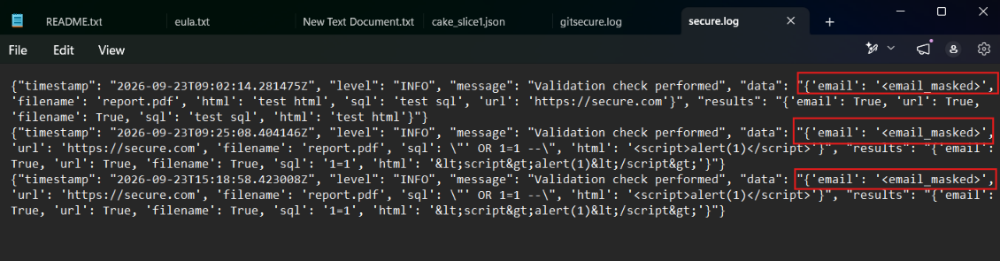
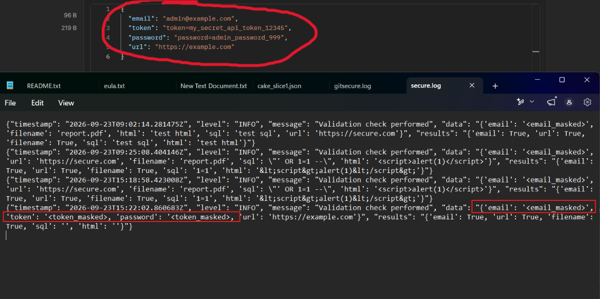
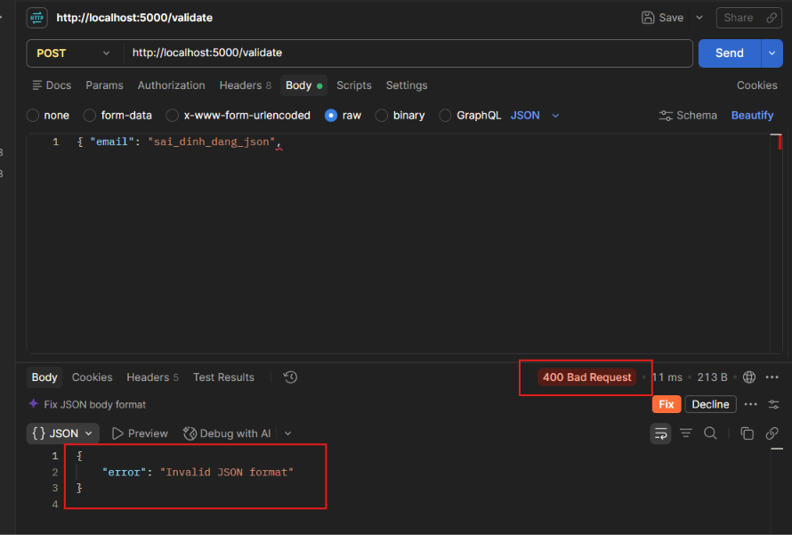
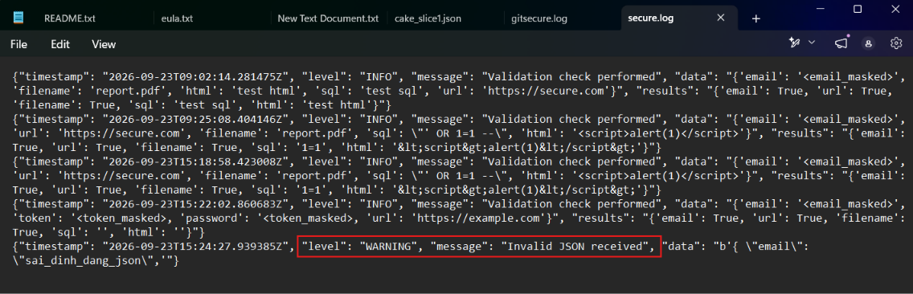
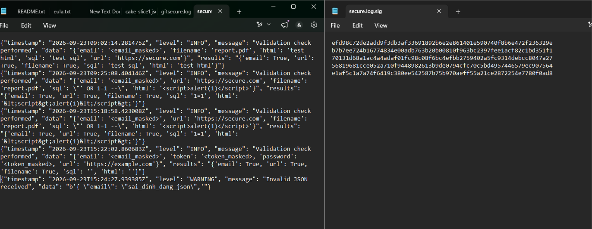

# BÁO CÁO THỰC HÀNH LAB 3: GHI NHẬT KÝ ƯU TIÊN BẢO MẬT (SECURE LOGGER)

- **Sinh viên**: Đặng Hải Tiến - MSSV: 2387700067
- **Môn học**: Thực hành Lập trình An ninh Thông tin (TH_LTANTT)

---

## 1. Mục tiêu
Xây dựng hệ thống **SecureLogger** tích hợp vào API Flask để ghi nhật ký an toàn: tự động che giấu thông tin định danh cá nhân (PII), định dạng JSON có cấu trúc, xoay vòng nén log và tạo chữ ký băm SHA-256 chống chỉnh sửa (Tamper Detection).

---

## 2. Tính năng chính
1. **Che giấu PII (PII Masking)**: Tự động phát hiện và ẩn Email thành `<email_masked>`, Token/Password thành `<token_masked>`.
2. **Cấu trúc JSON**: Xuất log có cấu trúc gồm: `timestamp`, `level`, `message`, `data`, `results`.
3. **Xoay vòng & Nén log (Log Rotation)**: Tự động luân phiên khi file đạt 1MB, lưu tối đa 2 bản backup và nén thành `.gz`.
4. **Chống thay đổi trái phép (Tamper Detection)**: Mỗi dòng log được băm **SHA-256** và ghi ngay vào `secure.log.sig` để kiểm toán toàn vẹn.

---

## 3. Cấu trúc thư mục
```text
Lab3/
├── Readme.md                       # Báo cáo tóm tắt & hình ảnh minh chứng
├── images/                         # Thư mục ảnh chụp kết quả kiểm thử
└── secure_logger_lab/
    ├── app.py                      # Flask API endpoint /validate
    ├── requirements.txt            # Thư viện phụ thuộc (Flask)
    ├── secure.log                  # File log JSON (đã che PII)
    ├── secure.log.sig              # File chữ ký băm SHA-256
    ├── securevalidator/            # Thư viện validate dữ liệu từ Lab 1
    └── securelogger/               # Module SecureLogger (logger.py, __init__.py)
```

---

## 4. Kết quả thực nghiệm (Test Cases)

### 📸 Case 1: Gửi Request kiểm tra dữ liệu qua Postman
- **Thao tác**: Gửi `POST` đến `http://localhost:5000/validate` với Body JSON chứa thông tin email, URL, filename, SQL và HTML script.
- **Kết quả**: API xử lý an toàn và trả về phản hồi `200 OK`:


---

### 📸 Case 2: Kiểm tra che giấu PII trong `secure.log`
- **Kết quả**: Dữ liệu email nhạy cảm đã được hệ thống tự động ẩn thành `<email_masked>` trước khi lưu vào file log:


---

### 📸 Case 3: Xử lý ngoại lệ khi gửi JSON sai định dạng
- **Thao tác**: Gửi body không đúng cú pháp JSON.
- **Kết quả**: Server bắt lỗi, trả về `400 Bad Request` (`Invalid JSON format`) và tự động ghi nhận vào log ở cấp độ `WARNING`:



---

### 📸 Case 4: Kiểm tra chữ ký băm SHA-256 chống chỉnh sửa (`secure.log.sig`)
- **Kết quả**: Mỗi dòng log đều được tính mã băm SHA-256 và lưu riêng biệt tại `secure.log.sig`. Nếu log bị sửa đổi trái phép, chữ ký băm sẽ không khớp giúp phát hiện ngay hành vi gian lận:


---

## 5. Kết luận
Hệ thống SecureLogger hoạt động ổn định, đáp ứng đầy đủ yêu cầu nghiệp vụ: bảo vệ quyền riêng tư người dùng (không lộ PII trong log) và đảm bảo tính toàn vẹn phục vụ công tác điều tra số (Forensics/Audit).
