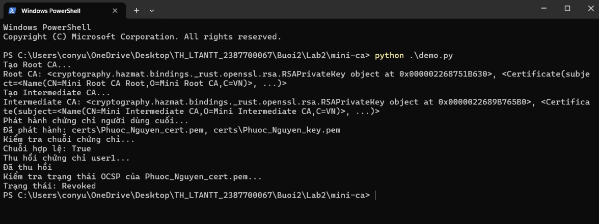
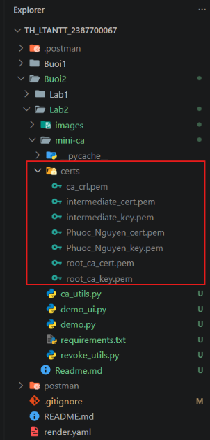
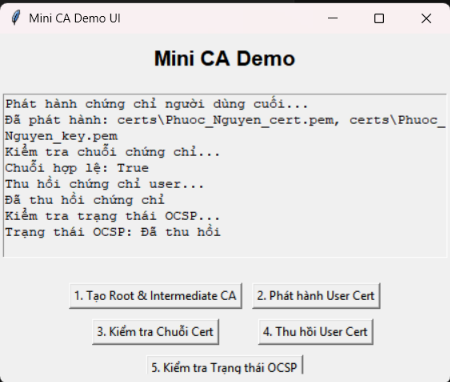

# BÁO CÁO THỰC HÀNH BUỔI 2 - LAB 2: HẠ TẦNG KHÓA CÔNG KHAI & XÂY DỰNG MINI-CA

- **Môn học**: Thực hành Lập trình An ninh Thông tin (TH_LTANTT)
- **Sinh viên**: Đặng Hải Tiến - MSSV: 2387700067
- **Chủ đề**: Xây dựng hệ thống thẩm quyền cấp chứng chỉ số (Mini-CA)

---

## 1. TỔNG QUAN LÝ THUYẾT

### 1.1. Cấp bậc Certificate Authority (CA)
Certificate Authority (CA) là tổ chức phát hành và quản lý chứng chỉ số (Digital Certificate), đảm bảo xác thực danh tính của các thực thể trong mạng lưới an toàn.

| Cấp bậc CA | Đặc điểm & Vai trò | Mức độ bảo mật |
| :--- | :--- | :--- |
| **Root CA (CA gốc)** | - Cấp cao nhất trong hệ thống phân cấp chứng chỉ.<br>- Phát hành chứng chỉ cho Intermediate CA hoặc người dùng.<br>- Được cài đặt sẵn vào Trust Store của hệ điều hành, trình duyệt. | Khóa riêng tư (Private Key) được bảo vệ cực kỳ nghiêm ngặt; nếu lộ, toàn bộ chuỗi tin cậy sụp đổ. |
| **Intermediate CA (CA trung gian)** | - Do Root CA ủy quyền cấp phát chứng chỉ.<br>- Chịu trách nhiệm trực tiếp ký và phát hành chứng chỉ cho End-entity.<br>- Giúp giảm tải rủi ro trực tiếp cho Root CA. | Có thể cấp mới hoặc thu hồi riêng biệt nếu bị xâm phạm mà không ảnh hưởng tới Root CA. |
| **End-entity Certificate** | - Cấp cho máy chủ (Web Server SSL/TLS), người dùng cá nhân, thiết bị.<br>- Dùng cho mã hóa truyền thông, xác thực danh tính, ký số.<br>- **Không có quyền** cấp phát chứng chỉ tiếp theo. | Sử dụng thường xuyên trong các kết nối mạng an toàn (HTTPS/TLS). |

**Ý nghĩa của kiến trúc phân cấp (Hierarchical CA):**
- **Chuỗi tin cậy (Chain of Trust)**: Tạo lập đường dẫn tin cậy từ Root CA -> Intermediate CA -> End-entity.
- **Cách ly rủi ro**: Khi một Intermediate CA bị lộ khóa, chỉ cần thu hồi chứng chỉ của Intermediate đó mà không làm ảnh hưởng toàn bộ hệ thống Root CA.
- **Khả năng mở rộng & Quản trị**: Dễ dàng phân chia thẩm quyền cấp phát theo vùng địa lý, phòng ban hoặc mục đích sử dụng.

---

### 1.2. Cấu trúc chứng chỉ số chuẩn X.509
Chứng chỉ X.509 là tiêu chuẩn quốc tế định dạng chứng chỉ khóa công khai (dùng trong SSL/TLS, S/MIME, IPsec). Các thành phần cốt lõi:

1. **Version number**: Phiên bản chuẩn X.509 (phổ biến nhất là v3).
2. **Serial number**: Số định danh duy nhất của chứng chỉ do CA cấp.
3. **Signature algorithm ID**: Thuật toán băm và ký (ví dụ: `sha256WithRSAEncryption`).
4. **Issuer name**: Tên tổ chức CA phát hành chứng chỉ.
5. **Validity period**: Thời hạn hiệu lực (gồm `Not Before` và `Not After`).
6. **Subject name**: Tên thực thể được cấp chứng chỉ (Common Name - CN, Organization, Country,...).
7. **Subject public key**: Khóa công khai của chủ thể và thuật toán liên kết (RSA 2048-bit,...).
8. **Extensions (X.509v3)**: Các trường mở rộng quan trọng:
   - `Basic Constraints`: Chỉ định đây là chứng chỉ CA (`is_ca=True/False`) và giới hạn độ sâu đường dẫn (`path_length`).
   - `Key Usage`: Mục đích sử dụng khóa (Digital Signature, Key Encipherment, Cert Sign, CRL Sign,...).
   - `Subject Alternative Name (SAN)`: Tên miền phụ, địa chỉ IP bổ sung cho máy chủ.
9. **Signature**: Chữ ký số của CA được tạo bằng cách băm toàn bộ nội dung chứng chỉ và mã hóa bằng Private Key của CA.

---

### 1.3. Quản lý vòng đời chứng chỉ số (Certificate Lifecycle)
Vòng đời chứng chỉ bao gồm 5 giai đoạn chính:
1. **Tạo chứng chỉ (Issuance)**: CA kiểm tra và xác minh danh tính người yêu cầu trước khi ký phát hành chứng chỉ.
2. **Phân phối (Distribution)**: Gửi chứng chỉ đến chủ thể để cài đặt lên dịch vụ (Web Server, Mail Server), công khai Public Key cho các bên kiểm tra.
3. **Gia hạn (Renewal)**: Thực hiện cấp lại trước khi chứng chỉ hiện tại hết hạn để đảm bảo hoạt động liên tục.
4. **Thu hồi (Revocation)**: Vô hiệu hóa chứng chỉ trước thời hạn khi phát hiện rò rỉ khóa riêng hoặc thông tin chứng chỉ không còn hợp lệ. Trạng thái thu hồi được công bố qua:
   - **CRL (Certificate Revocation List)**: Danh sách chứng chỉ bị thu hồi do CA định kỳ công bố.
   - **OCSP (Online Certificate Status Protocol)**: Giao thức truy vấn trạng thái hợp lệ trực tuyến tức thời.
5. **Hết hạn (Expiration)**: Khi quá thời gian `Not After`, chứng chỉ tự động mất hiệu lực và bị các hệ thống từ chối kết nối.

---

## 2. CẤU TRÚC DỰ ÁN MINI-CA
```text
Buoi2/Lab2/
├── mini-ca/
│   ├── certs/                      # Thư mục lưu trữ khóa (.key) và chứng chỉ (.crt)
│   ├── ca_utils.py                 # Bộ công cụ quản lý Root CA, Intermediate CA, End-entity
│   ├── revoke_utils.py             # Bộ công cụ thu hồi chứng chỉ (CRL) và kiểm tra OCSP
│   ├── demo.py                     # Kịch bản kiểm thử quy trình CA qua dòng lệnh (CLI)
│   ├── demo_ui.py                  # Giao diện đồ họa tương tác trực quan (Tkinter GUI)
│   └── requirements.txt            # Thư viện phụ thuộc (cryptography)
├── images/                         # Ảnh chụp màn hình kết quả kiểm thử các case
└── Readme.md                       # Báo cáo thực hành chi tiết
```

---

## 3. HƯỚNG DẪN THỰC HÀNH & KẾT QUẢ THỬ NGHIỆM

### 3.1. Cài đặt thư viện phụ thuộc
Di chuyển vào thư mục `Buoi2/Lab2/mini-ca` và cài đặt:
```powershell
pip install -r requirements.txt
```

---

### 3.2. Case 1: Kiểm thử toàn diện quy trình CA qua dòng lệnh (CLI)
Chạy script kiểm thử `demo.py`:
```powershell
python demo.py
```
**Kết quả thực thi:**
- Tạo Root CA tự ký thời hạn 10 năm (`path_length=1`).
- Tạo Intermediate CA do Root CA ký thời hạn 5 năm (`path_length=0`).
- Phát hành chứng chỉ người dùng cuối (End-Entity: `Phuoc_Nguyen`) thời hạn 1 năm.
- Xác thực chuỗi tin cậy: **`Chuỗi hợp lệ: True`**.
- Thu hồi chứng chỉ người dùng cuối do nghi ngờ lộ khóa riêng (`key_compromise`) và ghi vào CRL.
- Tra cứu trạng thái OCSP: **`Trạng thái: Revoked`**.



---

### 3.3. Case 2: Kiểm tra cấu trúc thư mục chứng chỉ và khóa (`certs/`)
Sau khi chạy kiểm thử, hệ thống tự động sinh ra và lưu trữ đầy đủ các tệp định dạng PEM trong thư mục `certs/`:
- `root_ca_cert.pem` & `root_ca_key.pem`: Chứng chỉ và khóa riêng của Root CA.
- `intermediate_cert.pem` & `intermediate_key.pem`: Chứng chỉ và khóa riêng của Intermediate CA.
- `Phuoc_Nguyen_cert.pem` & `Phuoc_Nguyen_key.pem`: Chứng chỉ và khóa riêng của người dùng cuối.
- `ca_crl.pem`: Danh sách các chứng chỉ đã bị thu hồi do CA ký số.



---

### 3.4. Case 3: Kiểm thử tương tác qua Giao diện đồ họa (GUI)
Khởi chạy ứng dụng GUI:
```powershell
python demo_ui.py
```
Lần lượt thao tác qua 5 chức năng chính:
1. **1. Tạo Root & Intermediate CA**: Sinh cặp khóa và chứng chỉ cho 2 cấp CA.
2. **2. Phát hành User Cert**: Cấp phát chứng chỉ cho thực thể cuối `Phuoc_Nguyen`.
3. **3. Kiểm tra Chuỗi Cert**: Xác thực chữ ký số ngược chuỗi từ User -> Intermediate -> Root (Hợp lệ: True).
4. **4. Thu hồi User Cert**: Đưa Serial Number vào danh sách thu hồi và ký phát hành CRL mới.
5. **5. Kiểm tra Trạng thái OCSP**: Truy vấn trực tiếp trạng thái chứng chỉ -> Thông báo "Đã thu hồi".



---

## 4. KẾT LUẬN
- Dự án `mini-ca` đã mô phỏng hoàn chỉnh và chính xác một hệ thống thẩm quyền chứng chỉ số (PKI) phân cấp 2 tầng theo chuẩn quốc tế X.509v3.
- Nắm vững quy trình sinh khóa RSA, cấu hình các extension bảo mật (`BasicConstraints`), ký số chứng chỉ, xác thực chuỗi tin cậy và quản lý vòng đời thu hồi qua CRL/OCSP.
- Đảm bảo tuân thủ nguyên tắc an ninh thông tin: phân cấp thẩm quyền tạo dựng chuỗi tin cậy và kiểm soát chặt chẽ trạng thái thu hồi chứng chỉ số.
