# BUỔI 3 — LAB 1: SECURECHAT

**Sinh viên:** Đặng Hải Tiến — **MSSV:** 2387700067
**Giáo trình:** mục 3.2, trang 3–14 của `lab-03.pdf` (giáo trình tham khảo, không kèm trong bài nộp).

## Thực hành từng bước và tự chụp màn hình

Phần này ghi lại lần thực hành thủ công với **7 ảnh chụp terminal thực tế của sinh viên**. Hai user `alice` và `bob` nhắn tin trong hai phòng `general` và `study`. Các ảnh ở Case 1–6 phía dưới bổ sung kết quả kiểm tra tự động.

### Bước 1 — Chuẩn bị

Mở project bằng VS Code, chọn **Terminal → New Terminal**. Nếu đang ở thư mục gốc repository, chạy:

```powershell
cd .\Buoi3\Lab1\secure-chat
python -m pip install -r requirements.txt
Test-Path .\certs\server\server.crt
Test-Path .\room_keys.json
```

Hai lệnh cuối cần trả về `True`. Nếu chưa có bộ chứng chỉ/khóa, chạy `python make_certs.py`. Nếu chương trình báo đã có chứng chỉ thì giữ bộ hiện tại để làm bài; không cần tạo lại.

Chứng chỉ `.crt` là giấy xác nhận danh tính; khóa riêng `.key` chứng minh chủ sở hữu danh tính đó; `ca.crt` giúp hai bên kiểm tra giấy xác nhận; `room_keys.json` chứa khóa mã hóa nội dung của từng phòng. Không mở nội dung `.key` hoặc `room_keys.json` để chụp báo cáo.

Để xem các file đã tạo mà không lộ khóa:

```powershell
Get-ChildItem .\certs -Recurse -File | Select-Object FullName
```

**Kết quả thực hành:** danh sách chứng chỉ và khóa của CA, server, Alice, Bob và Charlie đã được tạo; ảnh chỉ hiển thị đường dẫn file.

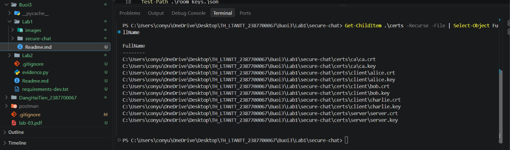

### Bước 2 — Chạy server

Ở terminal hiện tại (gọi là **Server**):

```powershell
python server.py
```

Khi thấy `Listening 127.0.0.1:8443; mTLS required`, server đã chờ kết nối. Giữ terminal này chạy. `127.0.0.1` là máy của bạn; `8443` là cổng server; `mTLS required` nghĩa là server và client đều phải đưa chứng chỉ để xác thực.

**Kết quả thực hành:** server lắng nghe tại `127.0.0.1:8443`, yêu cầu mTLS.

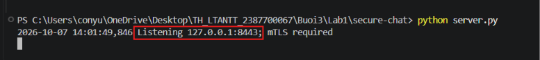

### Bước 3 — Kết nối Alice và Bob

Chọn **Terminal → New Terminal** hai lần. Trong **mỗi terminal mới**, chạy lệnh chuyển đến thư mục lab (đường dẫn tuyệt đối giúp tránh đi nhầm thư mục):

```powershell
cd 'C:\Users\conyu\OneDrive\Desktop\TH_LTANTT_2387700067\Buoi3\Lab1\secure-chat'
```

Terminal **Alice**:

```powershell
python client.py --username alice
```

Terminal **Bob**:

```powershell
python client.py --username bob
```

Mỗi client phải hiện `Verified server; TLSv1.3; identity=...` hoặc TLSv1.2. Terminal Server hiện `Authenticated client=alice` và `Authenticated client=bob`.

Trong lúc này, client kiểm tra chứng chỉ server bằng CA và hostname; server kiểm tra chứng chỉ client bằng CA rồi lấy CN làm danh tính. Cả hai mặc định vào phòng `general`. Chưa cần gửi tin nhắn để chứng minh bước kết nối thành công.

**Kết quả thực hành:** Alice và Bob đều xác minh server thành công, sử dụng TLSv1.3; server xác thực hai danh tính client.

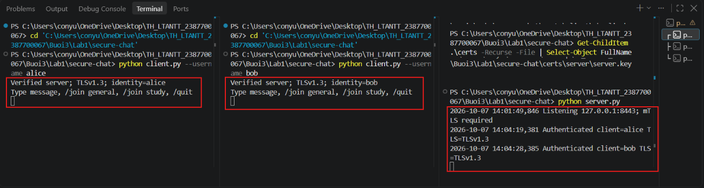

### Bước 4 — Chat hai chiều và quan sát server

Sau khi chạy client, terminal đang chờ **nội dung chat**, không còn chờ lệnh PowerShell. Trên Alice, gõ trực tiếp rồi Enter:

```text
Xin chào Bob, tôi là Alice!
```

Bob nhận:

```text
[general] alice: Xin chào Bob, tôi là Alice!
```

Trên Bob, nhập:

```text
Chào Alice, tôi đã nhận được tin nhắn.
```

Alice nhận dòng bắt đầu `[general] bob:`. Client gửi không tự in lại dưới dạng tin nhận; bạn vẫn thấy dòng mình đã gõ ở terminal. Server hiện `Relay client=... room=general ciphertext_bytes=...`, không hiện nội dung chat.

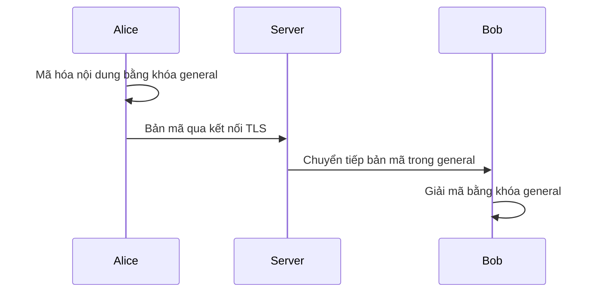

Có hai lớp bảo vệ: **TLS** bảo vệ kết nối client–server; **AES-GCM** bảo vệ nội dung ngay trên client, nên server chỉ xử lý bản mã. Đây là lý do Bob đọc được tin nhắn nhưng log server không có nội dung.

**Kết quả thực hành:** Alice và Bob trao đổi các tin `hi`, `chao ban`, `toi la bob day`, `duoc roi , toi la alice` trong phòng `general`. Phần khoanh đỏ thể hiện phiên kết nối lại và chat thành công; phía trên ảnh còn thông báo lỗi từ phiên trước.

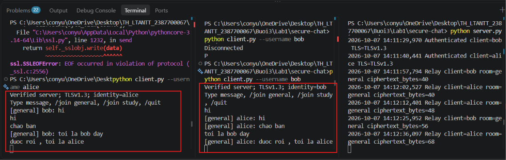

Server ghi người gửi, tên phòng và độ dài bản mã trong các dòng `Relay`; nội dung tin nhắn không xuất hiện trong các dòng log chuyển tiếp.

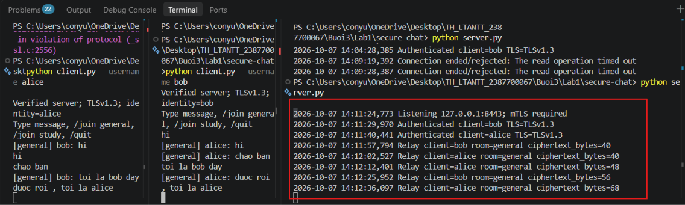

Thông báo `The read operation timed out` của phiên trước phù hợp với timeout chờ nhận 300 giây đang cấu hình trên server; sau khi khởi động lại/kết nối lại, các dòng Relay ghi nhận hoạt động chat.

### Bước 5 — Thử cách ly phòng

1. Trên **Bob**, nhập `/join study`, chờ dòng `{'type': 'joined', 'room': 'study'}`.
2. Trên **Alice** (vẫn ở general), nhập `Tin này chỉ dành cho phòng general`.
3. Quan sát Bob: không nhận tin này vì đang ở phòng study. Với chỉ hai client, general lúc này chỉ còn Alice nên không có người nhận.
4. Trên **Alice**, nhập `/join study`, chờ `joined`.
5. Trên **Alice**, nhập `Bây giờ cả hai đang ở study`.
6. Bob phải nhận `[study] alice: Bây giờ cả hai đang ở study`.

Server dựa vào membership do RoomManager quản lý để chọn người nhận. Client đổi sang khóa `study` để mã hóa. Lệnh `/join` được xử lý ở tầng điều khiển; nội dung chat vẫn được mã hóa trên client.

**Kết quả thực hành:** Bob chuyển vào `study` và nhận phản hồi `joined`. Alice gửi `Day la tin nhan o Phong General` khi còn ở `general`, rồi dùng `/join study`. Khi cả hai cùng ở `study`, Bob nhận `[study] alice: Day la tin nhan o Phong Study`. Hai tên phòng thực tế trong ảnh là `general` (phòng 1) và `study` (phòng 2).

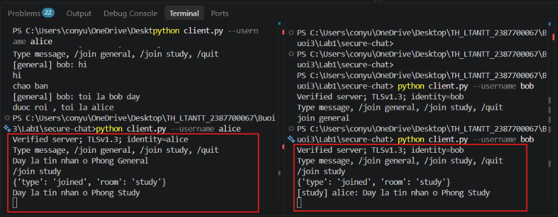

Muốn thấy một tin general vẫn được gửi cho người khác trong lúc Bob bị cách ly, mở thêm client `python client.py --username charlie`; Charlie ban đầu ở general, sẽ nhận tin general của Alice.

### Bước 6 — Ngắt kết nối và kiểm thử

Trên từng client, nhập `/quit`. Server ghi kết nối kết thúc và dọn client/phòng. Dừng Server bằng **Ctrl+C**. Sau khi đã quay lại dấu nhắc PowerShell, chạy:

```powershell
python -m pytest -q
python demo.py
```

Nếu thiếu pytest/Pillow: `python -m pip install pytest Pillow`. Kỳ vọng 4 unit test đạt; demo chạy 6 nhóm case, gồm sai hostname, CA không tin cậy, thiếu chứng chỉ client, bản mã bị sửa, sai khóa, tin dài và dọn kết nối. Demo dùng cổng riêng nên không cần server thủ công còn chạy.

**Kết quả thực hành:** `pytest` báo **4 passed**; `demo.py` báo PASS cho cả **6 nhóm case** chứng chỉ, chat, phòng, E2EE, từ chối TLS và TCP framing/dọn kết nối.

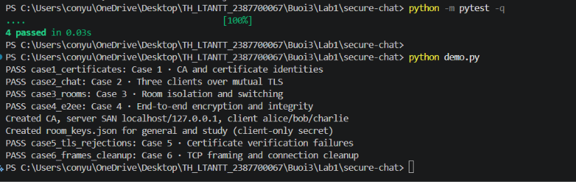

### Ảnh bổ sung cho các lần thực hành sau

Bảy ảnh `manual1_...` đến `manual7_...` đã được chèn trực tiếp vào các bước trên. Khi thực hành lại, có thể nhấn **Win+Shift+S**, lưu ảnh PNG vào `Buoi3/Lab1/images` và cập nhật chú thích theo kết quả mới. Giữ rõ lệnh, kết quả và nhãn terminal; không chụp nội dung khóa riêng hoặc khóa phòng.

## 1. Mục tiêu và cách hoạt động

| Thành phần yêu cầu | File thực hiện | Vai trò |
| --- | --- | --- |
| SecureChatServer | `secure-chat/server.py` | Server đa luồng, TLS 1.2+, bắt buộc chứng chỉ client |
| SecureChatClient | `secure-chat/client.py` | Kiểm tra CA, thời hạn, hostname server; nhận/gửi đồng thời |
| MessageEncryption | `secure-chat/message_encryption.py` | AES-256-GCM; client mã hóa và giải mã |
| ConnectionManager | `secure-chat/connection_manager.py` | Khóa đồng bộ danh sách client và thao tác gửi |
| RoomManager | `secure-chat/room_manager.py` | Chuyển phòng, chỉ broadcast trong cùng phòng, dọn kết nối |
| Chứng chỉ CA/server/client | `secure-chat/make_certs.py`, `make-certs.bat` | Tạo CA, SAN server và chứng chỉ alice/bob/charlie |
| Giao thức TCP | `secure-chat/protocol.py` | JSON có độ dài 4 byte; tránh tách/gộp sai tin nhắn |

Luồng: Alice mã hóa nội dung bằng khóa phòng → gửi bản mã qua mTLS → server chuyển bản mã cho client cùng phòng → Bob dùng khóa phòng để giải mã. Server không đọc file khóa phòng và không giải mã nội dung. Danh tính người gửi lấy từ CN của chứng chỉ client, không lấy từ username do người dùng tự khai.

**Điều chỉnh so với mã mẫu:** giáo trình dùng AES-CBC và gửi khóa cho server, để server giải mã/mã hóa lại; cách đó bảo vệ đường truyền nhưng chưa đạt E2EE. Bản thực hành dùng AES-GCM xác thực bản mã và giữ khóa trên client. Client giữ `check_hostname=True`; chứng chỉ có SAN `localhost` và `127.0.0.1`. Bộ sinh Python thay thao tác OpenSSL CLI để chạy được trên máy chưa cài OpenSSL, vẫn sinh chứng chỉ X.509/khóa PEM dùng được với TLS.

Giới hạn bài lab: khóa phòng được chia sẻ trước bằng kênh tin cậy; tất cả client trong demo dùng cùng file khóa. Đây là E2EE theo nhóm, chưa có trao đổi khóa tự động, xoay khóa khi thành viên rời phòng, chống replay ở tầng ứng dụng, CRL/OCSP hay chữ ký từng người gửi. Người có khóa phòng có thể đọc nội dung của phòng; server vẫn thấy metadata và có thể sửa nhãn người gửi. Không coi demo này là ứng dụng chat sản phẩm hoàn chỉnh.

## 2. Cài đặt và sinh chứng chỉ — Case 1

Từ thư mục gốc repository, sau khi kích hoạt môi trường theo [hướng dẫn chung](../Readme.md):

```powershell
cd Buoi3/Lab1/secure-chat
python -m pip install -r requirements.txt
python make_certs.py
# Hoặc: .\make-certs.bat
```

Kết quả: `certs/ca/ca.crt`, `ca.key`; `certs/server/server.crt`, `server.key`; các cặp `alice`, `bob`, `charlie` trong `certs/client/`; `room_keys.json` chứa khóa ngẫu nhiên cho `general`, `study`.

Nếu cần tạo lại toàn bộ: dừng server/client rồi chạy `python make_certs.py --force`. Khóa và CA cũ sẽ bị thay; mọi client phải dùng bộ mới. Không chạy `--force` khi đang chat.

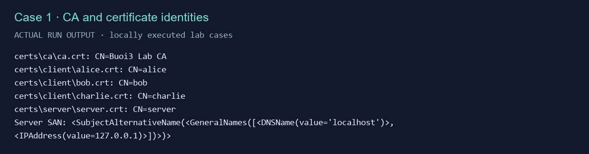

## 3. Chạy server và nhiều client — Case 2

Mở 4 terminal, đều ở `Buoi3/Lab1/secure-chat`, đều dùng cùng môi trường Python:

```powershell
# Terminal 1
python server.py
# Terminal 2
python client.py --username alice
# Terminal 3
python client.py --username bob
# Terminal 4
python client.py --username charlie
```

Server mặc định nghe `127.0.0.1:8443`. Trên Alice nhập `Xin chào Bob!`; Bob và Charlie trong `general` sẽ nhận. Nhập tin nhắn ở Bob để kiểm tra chiều ngược lại. Không chạy hai client cùng danh tính đồng thời. Dùng `/quit` hoặc `exit` để thoát; Ctrl+C để dừng server.

Nếu cổng 8443 bận: `python server.py --port 9443` và thêm `--port 9443` cho từng client.

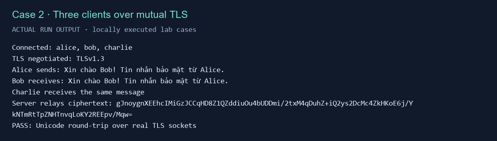

## 4. Phòng chat — Case 3

1. Trên Charlie nhập `/join study`, chờ phản hồi `joined`.
2. Alice gửi `general only`: Bob nhận, Charlie không nhận.
3. Trên Alice nhập `/join study`, chờ `joined`, rồi gửi `study only`: Charlie nhận.
4. Dùng `/join general` để quay lại phòng chung.

Client chỉ cho chuyển vào phòng có khóa trong `room_keys.json`. Khi chuyển phòng hoặc ngắt kết nối, RoomManager xóa thành viên ở phòng cũ.

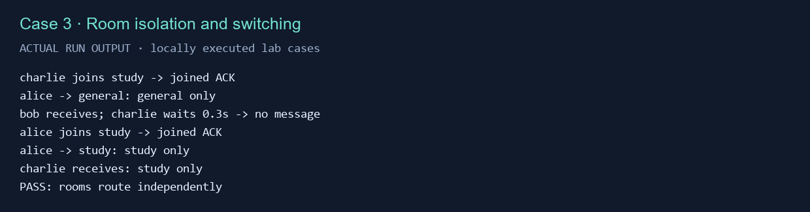

## 5. E2EE và toàn vẹn — Case 4

`python demo.py` tự thử: đổi một byte bản mã, giải mã bằng khóa khác, giải mã với tên phòng khác. Cả ba đều bị AES-GCM từ chối bằng `InvalidTag`. Khóa phòng không được gửi trong frame TLS; server log chỉ danh tính/phòng/độ dài bản mã. Tên phòng được dùng làm AAD để ràng buộc bản mã với phòng.

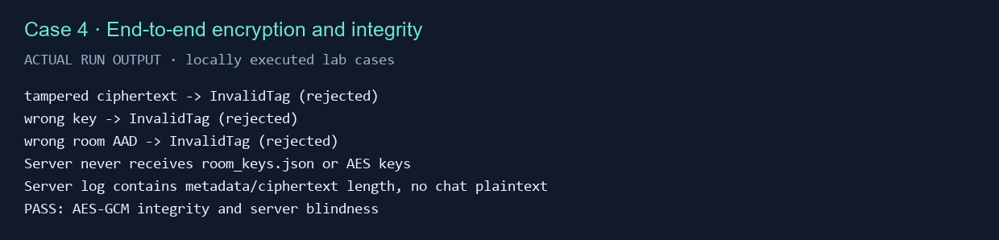

## 6. Xác minh chứng chỉ — Case 5

Chạy `python demo.py` để kiểm tra tự động bằng socket thật:

- Kết nối với hostname sai: client từ chối chứng chỉ server.
- Dùng CA khác làm trust root: client từ chối server.
- Client không đưa chứng chỉ: server từ chối bắt tay/trao đổi ứng dụng.

Không tắt kiểm tra hostname hoặc `CERT_REQUIRED` để vượt lỗi. Nếu sinh chứng chỉ trên Python mới, bộ sinh đã thêm AKI/SKI, KeyUsage và ExtendedKeyUsage để tương thích xác minh nghiêm ngặt.

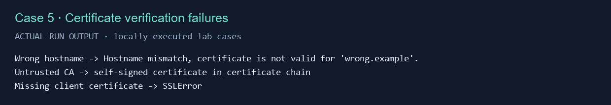

## 7. TCP framing và quản lý kết nối — Case 6

Demo gửi liên tiếp một tin 12.000 ký tự và một tin ngắn. Bob nhận đủ hai tin theo đúng thứ tự, dù dữ liệu có thể bị TCP chia thành nhiều lần `recv()`. Khi Bob ngắt kết nối, server còn 2 client và dọn membership của Bob. Giới hạn frame là 65.536 byte; vượt giới hạn bị từ chối.

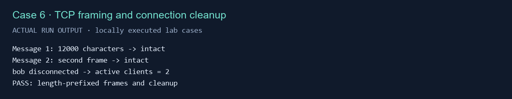

## 8. Tự kiểm tra và tái tạo ảnh

```powershell
python -m pytest -q
python demo.py
```

Đã chạy: **4 unit test đạt**, **6 nhóm case tích hợp đạt**. Demo tự chạy server trên cổng ngẫu nhiên và đóng kết nối khi xong. Các PNG là ảnh render từ kết quả chạy thật, không phải ảnh desktop; mỗi ảnh có file `.txt` cùng tên để đối chiếu. `demo-server.log` chứa log gốc tại máy và được Git bỏ qua.

### Lỗi thường gặp

| Lỗi | Cách xử lý |
| --- | --- |
| File chứng chỉ chưa có | Chạy `python make_certs.py` trước |
| `CERTIFICATE_VERIFY_FAILED` | Kiểm tra đúng bộ CA/chứng chỉ, hostname và đồng hồ máy; sinh lại nếu cần |
| `InvalidTag` / rejected message | Client phải dùng cùng khóa phòng; kiểm tra có vừa sinh lại khóa không |
| Connection refused | Chạy server trước và khớp `--port` |
| Identity already connected | Thoát client cũ hoặc chọn bob/charlie |
| Thiếu thư viện | Dùng `python -m pip install -r requirements.txt` với đúng Python đang chạy |
