# BUỔI 3 — LAB 2: NETRECON

**Sinh viên:** Đặng Hải Tiến — **MSSV:** 2387700067
**Giáo trình:** mục 3.4, trang 15–29 của `lab-03.pdf` (giáo trình tham khảo, không kèm trong bài nộp).

## Báo cáo thực hành từng bước

Phần này ghi lại lần thực hành của sinh viên với **14 ảnh chụp thực tế**, bao phủ các bước chuẩn bị dịch vụ, TCP/UDP, nhận dạng dịch vụ, policy, web, SMTP local và audit log. Các ảnh `case...` ở phần bên dưới bổ sung kết quả kiểm tra tự động trước đó.

### Bước 1 — Chuẩn bị và phân chia terminal

Mở project trong VS Code, chọn **Terminal → New Terminal**. Trong **mỗi terminal mới**, chạy:

```powershell
cd 'C:\Users\conyu\OneDrive\Desktop\TH_LTANTT_2387700067\Buoi3\Lab2\netrecon'
```

Ở terminal đầu tiên, cài thư viện bằng đúng Python đang dùng:

```powershell
python -m pip install -r requirements.txt
if (-not (Test-Path .env)) { Copy-Item .env.example .env }
```

Lệnh trên chỉ tạo `.env` khi chưa có, tránh ghi đè cấu hình bạn đã điền. Trong `.env`, giữ các dòng chính sách sau cho bài thực hành cục bộ:

```dotenv
NETRECON_WHITELIST=127.0.0.0/8
NETRECON_BLACKLIST=
```

`127.0.0.1` là máy của bạn. Whitelist quy định phạm vi được quét; blacklist quy định địa chỉ phải bỏ qua và được ưu tiên hơn whitelist.

Bạn sẽ dùng 4 terminal, có thể đổi tên bằng menu của tab terminal:

| Terminal | Chương trình | Giữ chạy? |
| --- | --- | --- |
| Targets | `python demo_targets.py` | Có, để các dịch vụ mẫu hoạt động |
| CLI | Các lệnh `python cli.py ...`, xem log, chạy test | Mỗi lệnh chạy xong sẽ trả về dấu nhắc |
| Web | `python app.py` | Có, để truy cập giao diện web |
| Mail | `python demo_mail.py` | Có, khi thực hành gửi email local |

Nếu dùng môi trường `.venv`, kích hoạt cùng môi trường ở mỗi terminal như [hướng dẫn chung](../Readme.md). Không nhập lệnh CLI vào terminal đang chạy Targets/Web/Mail; mở terminal CLI riêng.

### Bước 2 — Tạo các dịch vụ để quét

Trong terminal **Targets**:

```powershell
python demo_targets.py
```

Kỳ vọng thấy:

```text
Local targets: HTTP TCP 8000, SSH-like TCP 8022, UDP echo 8053; Ctrl+C to stop
```

| Cổng | Ý nghĩa |
| --- | --- |
| TCP 8000 | Web HTTP thật, trả header `Server: NetReconLab/1.0` |
| TCP 8022 | Dịch vụ gửi greeting mô phỏng SSH; không có chức năng đăng nhập SSH |
| UDP 8053 | Dịch vụ echo trả lời dữ liệu UDP |
| TCP 8001 | Dự kiến không có dịch vụ; dùng để thử cổng đóng |

Giữ terminal này chạy trong các bước tiếp theo. **Targets là đối tượng bị quét; NetRecon trong terminal CLI là công cụ đi quét.**

**Kết quả thực hành:** Dịch vụ HTTP TCP 8000, SSH-like TCP 8022 và UDP echo 8053 đã chạy sau khi chuyển vào đúng thư mục `netrecon`. Lỗi phía trên ảnh là lần gọi file từ thư mục gốc trước đó.

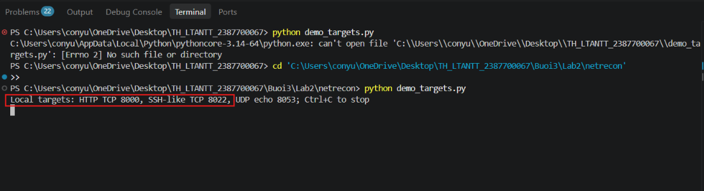

### Bước 3 — Quét TCP và đọc kết quả

Trong terminal **CLI**:

```powershell
python cli.py --target 127.0.0.1 --ports 8000,8001,8022 --mode scan --rate-limit 10
```

Giải thích tham số:

| Tham số | Ý nghĩa |
| --- | --- |
| `--target 127.0.0.1` | Quét chính máy đang chạy dịch vụ mẫu |
| `--ports 8000,8001,8022` | Chỉ kiểm tra 3 cổng này |
| `--mode scan` | Chỉ lấy trạng thái cổng |
| `--rate-limit 10` | Giãn thời điểm bắt đầu probe theo mức 10 probe/giây |

Đọc từng phần tử trong mục `scan`: cổng 8000 và 8022 phải có `state: open`; cổng 8001 dự kiến `closed` nếu không bị dịch vụ khác chiếm. Các dòng được sắp theo số cổng.

TCP Connect Scan thử thiết lập một kết nối TCP đầy đủ. Thành công → `open`; kết nối bị từ chối → `closed`; hết thời gian chờ → `filtered` (ước lượng, chưa chắc do firewall). Trên Windows, phản hồi từ chối có thể mất vài giây nên đừng kết luận công cụ bị treo ngay.

Thử cách viết khoảng cổng:

```powershell
python cli.py --target localhost --ports 8000-8002 --mode scan
```

`localhost` được chuyển thành địa chỉ IPv4, kiểm tra whitelist rồi mới quét.

**Kết quả thực hành:** TCP 8000 và 8022 mở; 8001 đóng. Lệnh dùng khoảng 8000–8002 kiểm tra 8000, 8001 và 8002; localhost được resolve thành 127.0.0.1.

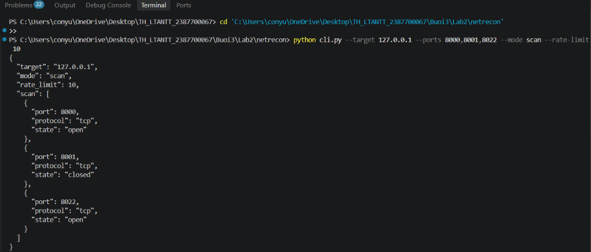

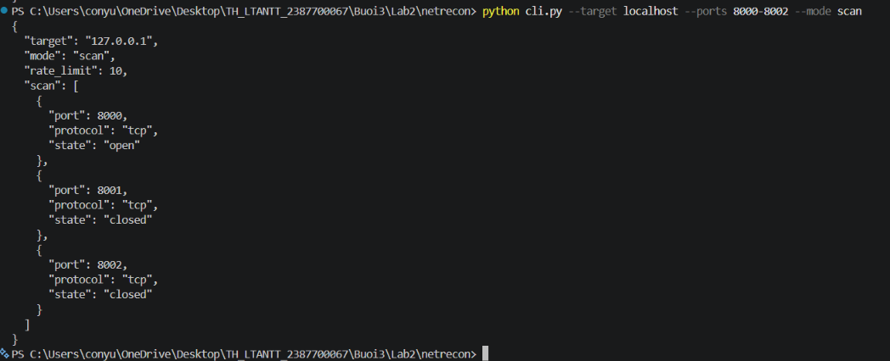

### Bước 4 — Quét UDP

Trong terminal **CLI**:

```powershell
python cli.py --target 127.0.0.1 --ports 8053 --protocol udp --mode scan
```

Kỳ vọng cổng 8053 có `protocol: udp`, `state: open`. Scanner gửi một datagram; UDP echo trả lời nên có bằng chứng cổng đang mở.

UDP không thiết lập kết nối như TCP. Với dịch vụ không trả lời payload mẫu, timeout chỉ cho phép ghi `open|filtered`: có thể cổng mở nhưng bỏ qua dữ liệu, hoặc lưu lượng bị lọc.

**Kết quả thực hành:** UDP 8053 trả lời probe, kết quả `open`.

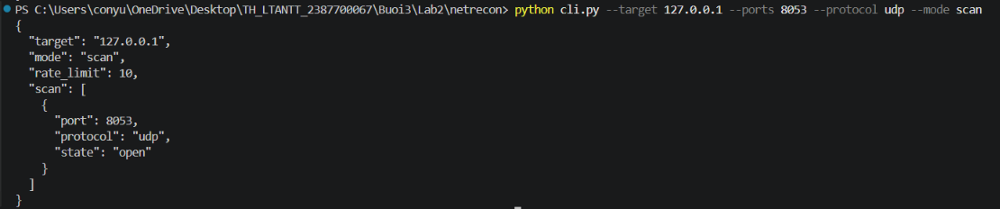

### Bước 5 — Banner, nhận dạng dịch vụ và kiểm tra cấu hình

Trong terminal **CLI**:

```powershell
python cli.py --target 127.0.0.1 --ports 8000,8022 --mode all
```

Đầu ra dài, kéo lên và đọc lần lượt:

| Mục | Kết quả cần quan sát | Cách hoạt động |
| --- | --- | --- |
| `scan` | 8000 và 8022 mở | Kiểm tra kết nối trước |
| `banner` | HTTP header và `SSH-2.0-NetReconLab_1.0` | Đọc greeting; nếu chưa có thì thử HTTP HEAD |
| `service` | `HTTP / NetReconLab/1.0` và SSH-like | Phân tích dấu hiệu trong banner |
| `vuln` | HTTP plaintext và lộ banner | Đưa ra dấu hiệu cấu hình cần xem xét |
| `map` | Danh sách IP/MAC từ ARP cache | Đọc bảng láng giềng có sẵn trên máy |

`vuln` không chứng minh hệ thống có CVE và không khai thác mục tiêu. `map` có thể rỗng, chứa broadcast/multicast hoặc khác trên mỗi máy; đó là ARP cache, không phải toàn bộ sơ đồ mạng.

Muốn xem từng chức năng ngắn gọn:

```powershell
python cli.py --target 127.0.0.1 --ports 8000,8022 --mode service
python cli.py --target 127.0.0.1 --ports 8000 --mode banner
python cli.py --target 127.0.0.1 --ports 8000 --mode vuln
python cli.py --target 127.0.0.1 --mode map
```

Ngay cả mode service/banner/vuln cũng quét trước và chỉ xử lý cổng TCP đã xác nhận mở.

**Kết quả thực hành:** Nhận dạng HTTP / NetReconLab/1.0 và SSH-2.0-NetReconLab_1.0; review ghi HTTP plaintext và lộ banner. ARP cache được đọc và hiển thị riêng.

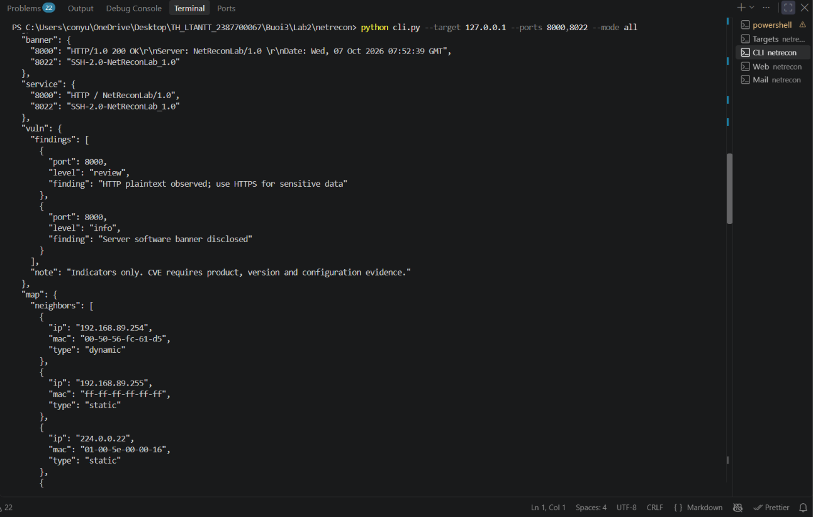

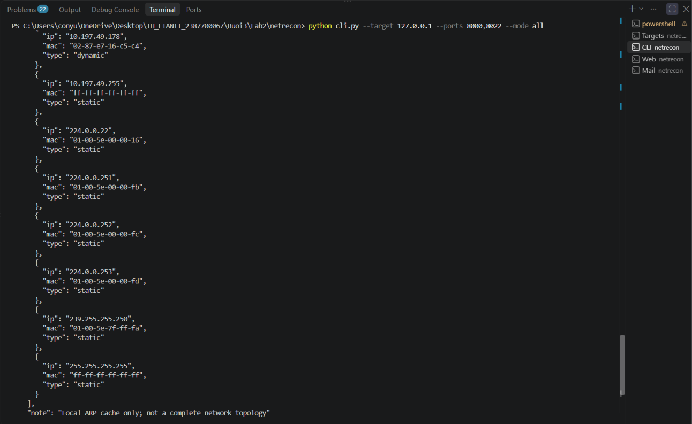

### Bước 6 — Whitelist, blacklist, input sai và tốc độ quét

Trong terminal **CLI**, thử chặn target:

```powershell
python cli.py --target 127.0.0.1 --ports 8000 --mode scan --whitelist 127.0.0.0/8 --blacklist 127.0.0.1
```

Kỳ vọng `Error: Target blocked by whitelist/blacklist`. Địa chỉ nằm trong whitelist nhưng blacklist vẫn thắng; không có probe gửi tới target trong lượt này.

Thử cổng không hợp lệ:

```powershell
python cli.py --target 127.0.0.1 --ports 65536 --mode scan
```

Kỳ vọng thông báo cổng phải thuộc 1–65535. Một lượt chỉ cho tối đa 256 cổng để giới hạn khối lượng công việc.

Thử tốc độ thấp:

```powershell
python cli.py --target 127.0.0.1 --ports 8000-8003 --mode scan --rate-limit 5
```

Các lần bắt đầu probe được giãn tối thiểu khoảng 0,2 giây. Tổng thời gian còn bao gồm chờ phản hồi hoặc timeout; không dùng tổng thời gian này để khẳng định chính xác tốc độ. Rate limit áp dụng trong từng lượt quét của Python, không phải giới hạn tổng mọi gói mạng của máy.

**Kết quả thực hành:** Blacklist chặn target dù target nằm trong whitelist; cổng 65536 bị từ chối. Lượt quét tiếp theo sử dụng `rate_limit: 5` và trả kết quả cổng 8000–8003.

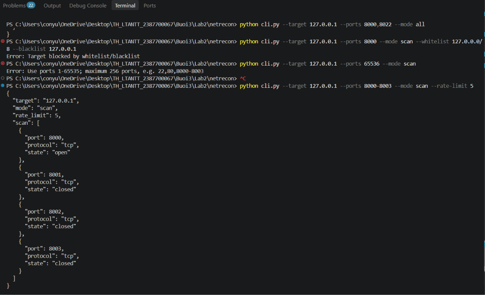

### Bước 7 — Chạy giao diện web

Trong terminal **Web**, đã chuyển vào `netrecon`:

```powershell
python app.py
```

Giữ terminal chạy. Mở [http://127.0.0.1:5000](http://127.0.0.1:5000) và điền:

| Trường | Giá trị |
| --- | --- |
| Target IP / hostname | `127.0.0.1` |
| Cổng | `8000,8001,8022` |
| Chế độ | `All` |
| Giao thức | `tcp` |
| Tốc độ | `10` |
| Kỹ thuật | `TCP Connect / UDP probe` |
| Dùng Nmap đã cài đặt | Chưa chọn trong lần thực hành này |
| Email | Để trống trước |

**Kết quả thực hành:** Form web đã điền target 127.0.0.1, cổng 8000,8001,8022, mode All, TCP, tốc độ 10; chưa chọn Nmap và chưa yêu cầu email.

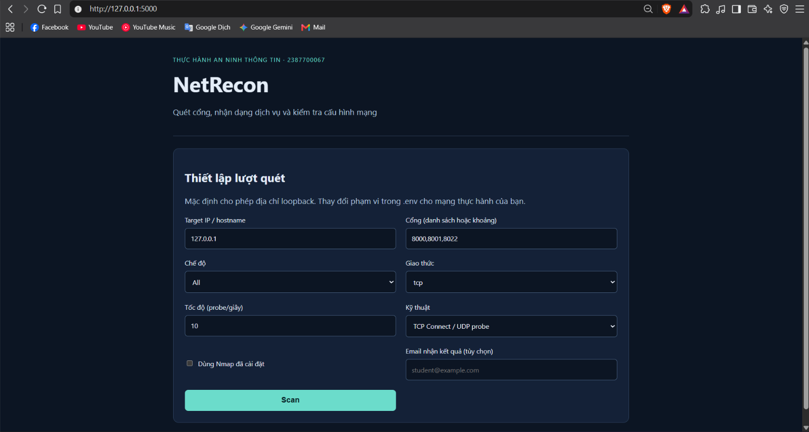

Bấm **Scan**, đợi kết quả. Quan sát SCAN/BANNER/SERVICE/VULN/MAP, đối chiếu với CLI ở bước 5. Giao diện web và CLI gọi chung `modules/runner.py`, nên cùng đầu vào sẽ thực hiện cùng quy trình.

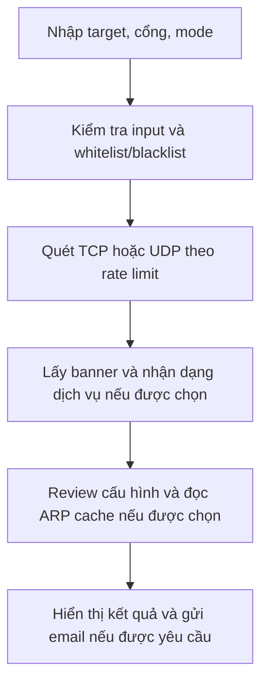
```mermaid
flowchart TD
    A[Nhập target, cổng, mode] --> B[Kiểm tra input và whitelist/blacklist]
    B --> C[Quét TCP hoặc UDP theo rate limit]
    C --> D[Lấy banner và nhận dạng dịch vụ nếu được chọn]
    D --> E[Review cấu hình và đọc ARP cache nếu được chọn]
    E --> F[Hiển thị kết quả và gửi email nếu được yêu cầu]
```

**Kết quả thực hành:** Web trả trạng thái cổng và banner, nhận dạng dịch vụ, dấu hiệu cấu hình và bảng ARP tương ứng với CLI.

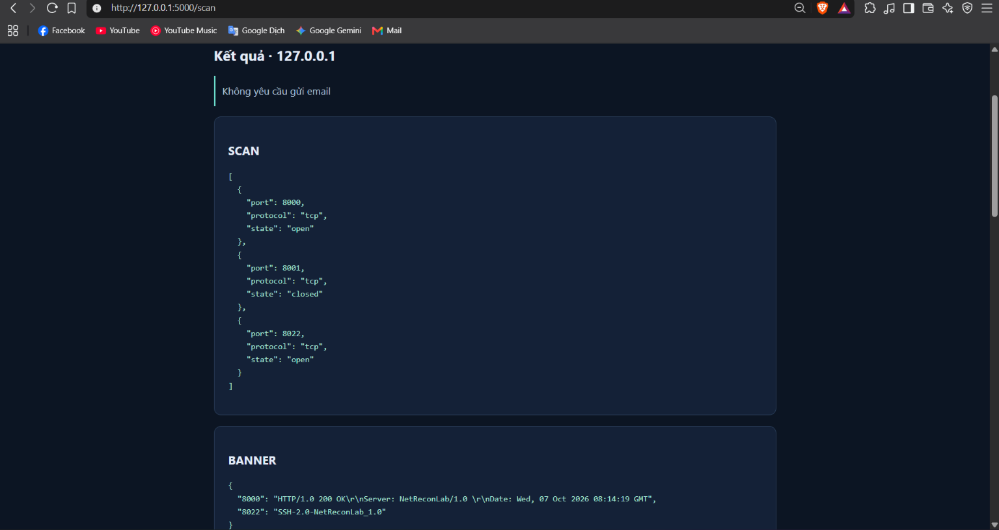

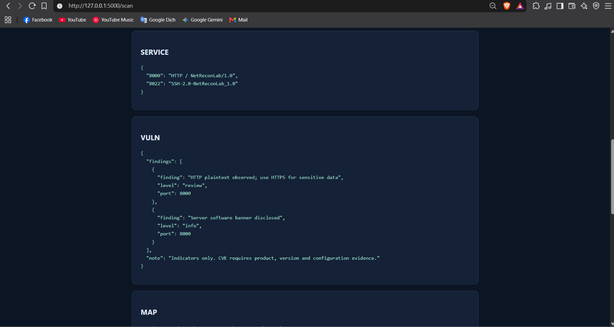

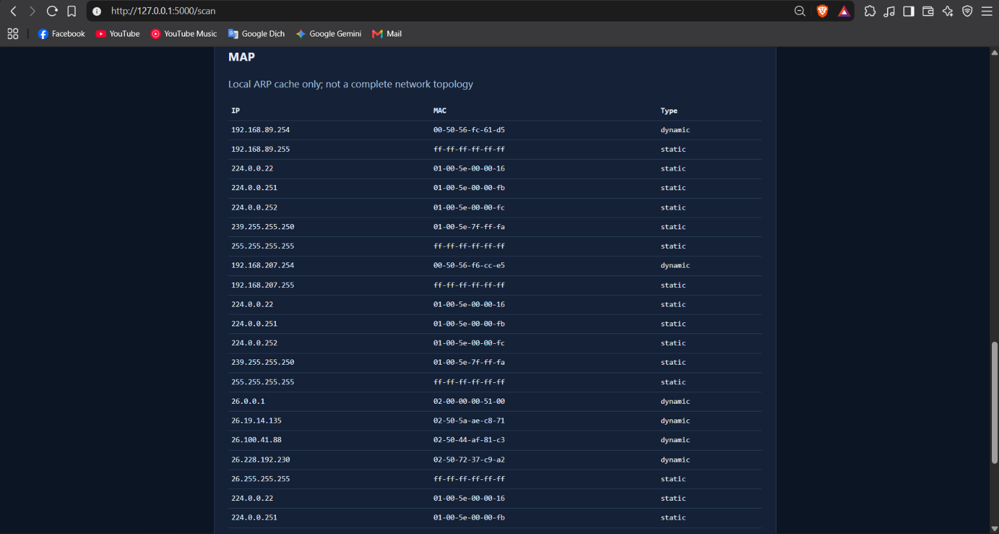

Quay lại form, nhập cổng `65536`, bấm Scan để thấy lỗi validation. Có thể lưu ảnh bổ sung `manual7_web_error.png`.

### Bước 8 — Gửi kết quả vào hộp thư SMTP cục bộ

Trong terminal **Mail**:

```powershell
python demo_mail.py
```

Kỳ vọng `Local SMTP inbox 127.0.0.1:1025; messages saved to demo-inbox.eml`. Giữ terminal chạy. Mở `.env` trong VS Code và sửa các dòng SMTP thành:

```dotenv
SMTP_HOST=127.0.0.1
SMTP_PORT=1025
SMTP_MODE=local
SMTP_USER=netrecon@localhost
SMTP_PASS=
```

Giữ nguyên hai dòng whitelist/blacklist đã cấu hình. Dừng **Web** bằng Ctrl+C rồi chạy lại `python app.py` để nạp `.env` mới. Targets và Mail vẫn chạy.

Trên web, điền target/cổng/mode như bước 7, nhập email `student@example.test`, bấm Scan. Kỳ vọng:

```text
Email accepted by local demo inbox (not Gmail)
```

Trong Explorer của VS Code, mở `netrecon/demo-inbox.eml`. Xem `To`, `Subject` và nội dung kết quả. Nếu MIME mã hóa nội dung nên khó đọc, trong terminal CLI chạy:

```powershell
python -c "from email import policy; from email.parser import BytesParser; from pathlib import Path; m=BytesParser(policy=policy.default).parsebytes(Path('demo-inbox.eml').read_bytes()); print('To:',m['To']); print('Subject:',m['Subject']); print(m.get_body().get_content())"
```

App kết nối SMTP ở localhost, gửi email qua socket thật; hộp thư demo nhận và lưu vào file. Địa chỉ `.test` chỉ dùng trong demo, không gửi tới hộp thư Gmail. Gmail dùng SMTP SSL và mật khẩu ứng dụng riêng, xem mục bên dưới nếu muốn làm thêm.

**Kết quả thực hành:** Web báo email được hộp thư local chấp nhận. Email đã lưu có From netrecon@localhost, To student@example.test, tiêu đề “Kết quả quét từ NetRecon” và nội dung kết quả scan. Đây là SMTP local, không phải Gmail.

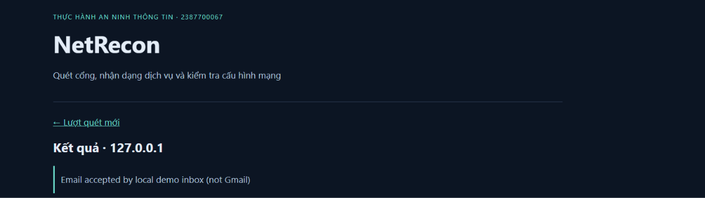

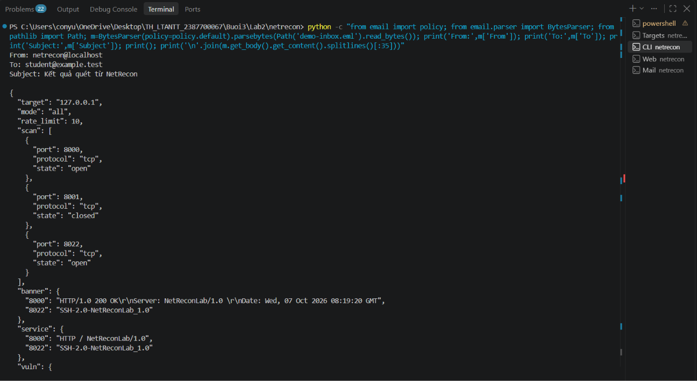

### Bước 9 — Xem audit log và kiểm thử

Trong terminal **CLI**:

```powershell
Get-Content netrecon.log -Tail 20
python -m pytest -q
```

Kỳ vọng **11 passed**. Nếu thiếu pytest: `python -m pip install pytest`. Trong log, tìm các dòng tương ứng với thao tác đã làm:

| Nhãn log | Ý nghĩa |
| --- | --- |
| ALLOW / BLOCK | Chính sách cho phép hoặc chặn target |
| START / END | Bắt đầu và kết thúc lượt quét |
| PROBE | Target, cổng, giao thức, trạng thái |
| BANNER / SERVICE | Banner đọc được và nhận dạng dịch vụ |
| VULN / MAP | Dấu hiệu cấu hình và ARP cache |
| EMAIL | Kết quả được gửi qua SMTP |

Có thể chạy thêm `python demo.py`: chương trình tự tạo dịch vụ trên cổng ngẫu nhiên, kiểm tra 6 nhóm case và đóng dịch vụ của nó khi xong. Nó cũng ghi đè email demo local bằng email của lượt kiểm tra, nên hãy chụp email thủ công ở bước 8 trước.

**Kết quả thực hành:** Audit log có timestamp, ALLOW, START, PROBE, BANNER, SERVICE, VULN, MAP, END và EMAIL. Bộ kiểm thử báo **11 passed**.

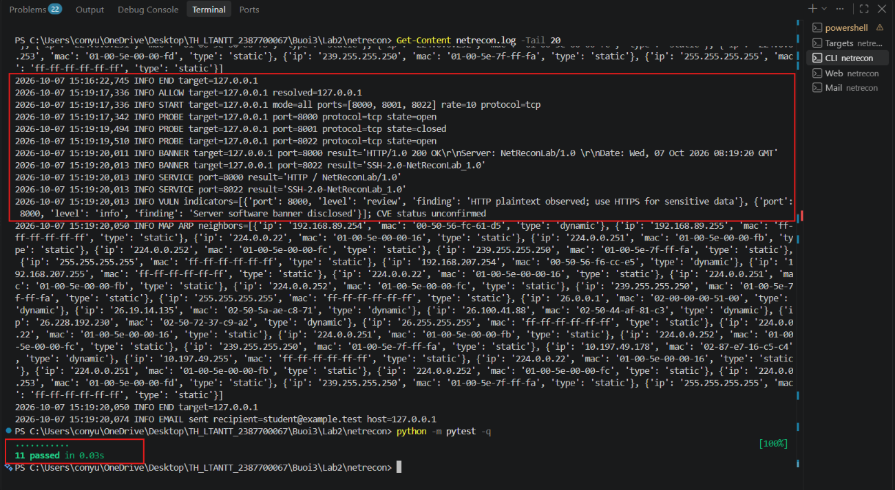

### Bước 10 — Kết thúc và lưu ảnh báo cáo

Nhấn Ctrl+C trong các terminal Targets, Web và Mail khi làm xong. Terminal CLI không cần dừng nếu đã trở về dấu nhắc.

Nhấn **Win+Shift+S**, chọn vùng cần chụp, mở thông báo Snipping Tool và lưu PNG vào `Buoi3/Lab2/images`. Ảnh cần đọc rõ lệnh và kết quả; trang web dài có thể chụp nhiều phần. Danh sách ảnh chính:

| Ảnh | File | Nội dung |
| --- | --- | --- |
| 1 | `manual1_targets.png` | Dịch vụ mẫu đang chạy |
| 2 | `manual2_tcp.png` | TCP open/closed |
| 3 | `manual3_udp.png` | UDP có phản hồi |
| 4 | `manual4_services.png` | Banner, service, review cấu hình |
| 5 | `manual5_policy.png` | Blacklist, input sai; rate limit nếu chụp kèm |
| 6 | `manual6_web_form.png` | Form web trước khi Scan |
| 7 | `manual7_web_result.png` | Kết quả web |
| 8 | `manual8_email.png` | Email đã nhận ở hộp thư local |
| 9 | `manual9_log_tests_2.png` | Audit log và 11 test đạt |

Đã chèn đủ 14 ảnh thực hành có trong thư mục `images` vào các bước tương ứng. Các file có hậu tố `_2`, `_3` ghi lại các phần đầu ra dài. Phần Nmap/SYN và Gmail ở các mục bên dưới là các bước mở rộng cần công cụ/tài khoản tương ứng.

### Xử lý lỗi khi thực hành

| Hiện tượng | Cách kiểm tra và xử lý |
| --- | --- |
| `ModuleNotFoundError` | Cài requirements với `python -m pip` của đúng môi trường đang chạy |
| `WinError 10048` khi chạy Targets | Cổng bị chiếm hoặc Targets đã chạy ở terminal khác; dừng bản demo cũ bằng Ctrl+C |
| 8000/8022 không mở | Kiểm tra Targets còn chạy và có đúng target `127.0.0.1` không |
| 8001 mở | Có dịch vụ khác trên cổng đó; chọn cổng trống khác cho case closed |
| Target bị chặn ngoài dự kiến | Kiểm tra `.env`, blacklist và biến môi trường của terminal; restart web sau khi sửa |
| Không mở được web | Kiểm tra `app.py` còn chạy và đúng cổng; nếu 5000 bận, dùng `$env:NETRECON_PORT='5003'` rồi chạy lại |
| Email connection refused | Kiểm tra Mail đang chạy trên 1025, SMTP_MODE=local và app đã restart |
| Lỗi yêu cầu SMTP_USER/SMTP_PASS | Kiểm tra có đang dùng mode ssl thay vì local; sửa `.env` rồi restart |
| Không có `demo-inbox.eml` | Đã điền email và Scan chưa? File chỉ tạo khi SMTP nhận được email |

## 1. Thành phần

| Yêu cầu | File trong `netrecon/` | Thực hiện |
| --- | --- | --- |
| PortScanner | `modules/port_scanner.py` | TCP Connect, UDP probe, giới hạn probe/giây |
| ServiceDetector | `modules/service_detector.py` | Nhận dạng banner; tùy chọn Nmap `-sV` |
| BannerGrabber | `modules/banner_grabber.py` | Timeout, tối đa 2048 byte, HTTP HEAD khi không có greeting |
| NetworkMapper | `modules/network_mapper.py` | Đọc ARP cache, phân tích IP/MAC/thông tin láng giềng |
| VulnChecker | `modules/vuln_checker.py` | Dấu hiệu HTTP/plaintext và lộ banner; không suy CVE từ số cổng |
| Whitelist/blacklist | `modules/filter_utils.py` | IPv4/CIDR, blacklist ưu tiên, kiểm tra IP đã resolve |
| Audit | `modules/audit.py` | Log timestamp cho target, probe, banner, service, map, email |
| CLI/Web/Email | `cli.py`, `app.py`, `modules/email_sender.py` | Dùng chung runner, web Flask, SMTP SSL hoặc inbox local |

Các mode: `scan`, `service`, `banner`, `map`, `vuln`, `all`. Trừ `map`, công cụ quét trước để xác định cổng mở; chỉ lấy banner/kiểm tra cấu hình trên cổng TCP thực sự mở. Cổng TCP timeout được báo `filtered` (ước lượng); UDP không phản hồi được báo `open|filtered`, không khẳng định đóng. Banner có thể bị dịch vụ giả mạo; nhận dạng phiên bản là bằng chứng quan sát, chưa xác nhận lỗ hổng.

**Điều chỉnh so với giáo trình:** semaphore chỉ giới hạn đồng thời; bản này dùng RateLimiter giãn thời điểm bắt đầu probe theo giây. Kết quả quét được trả về và hiển thị; parse được khoảng cổng; web kiểm tra lỗi; whitelist/blacklist áp dụng trước mọi probe; SMTP đọc `.env`. Không dùng bảng port → CVE của mã mẫu vì một số cổng mở không đủ chứng minh CVE.

## 2. Chuẩn bị

Từ gốc repository, kích hoạt môi trường theo [hướng dẫn chung](../Readme.md), rồi:

```powershell
cd Buoi3/Lab2/netrecon
python -m pip install -r requirements.txt
Copy-Item .env.example .env
```

Mặc định whitelist là `127.0.0.0/8`. Nếu thực hành trên máy trong mạng lab của bạn, chỉnh `NETRECON_WHITELIST` thành IP/CIDR tương ứng trong `.env`. Web sử dụng chính sách trong `.env`; CLI có thể truyền `--whitelist`/`--blacklist`. Tên miền được resolve một lần thành IPv4 rồi kiểm tra và quét IP đó.

### Dịch vụ mẫu để tái hiện kết quả

Terminal 1, trong `netrecon/`:

```powershell
python demo_targets.py
```

Tạo HTTP thật ở TCP 8000, greeting **mô phỏng SSH** ở TCP 8022 và UDP echo ở 8053. Cổng 8001 dự kiến đóng; nếu máy đang có dịch vụ khác, chọn cổng trống khác. Greeting ở 8022 không phải SSH server có đăng nhập. Dừng bằng Ctrl+C.

## 3. TCP CLI — Case 1

Terminal 2:

```powershell
python cli.py --target 127.0.0.1 --ports 8000,8001,8022 --mode scan --rate-limit 10
python cli.py --target localhost --ports 8000-8002 --mode scan
```

Kỳ vọng: 8000/8022 `open`, 8001 `closed`. Ảnh demo dưới dùng cổng ngẫu nhiên để tránh đụng dịch vụ đang có; số cổng có thể khác lệnh thực hành, hành vi giống nhau.

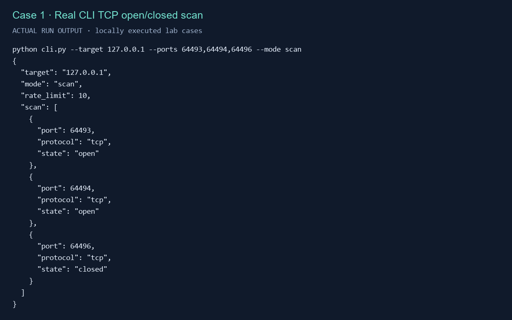

## 4. UDP — Case 2

```powershell
python cli.py --target 127.0.0.1 --ports 8053 --protocol udp --mode scan
```

UDP echo trả dữ liệu → `open`. Dịch vụ UDP khác có thể bỏ qua payload mẫu; khi timeout chỉ kết luận `open|filtered`. Muốn nhận dạng giao thức UDP chuyên biệt, dùng Nmap sau khi cài đặt.

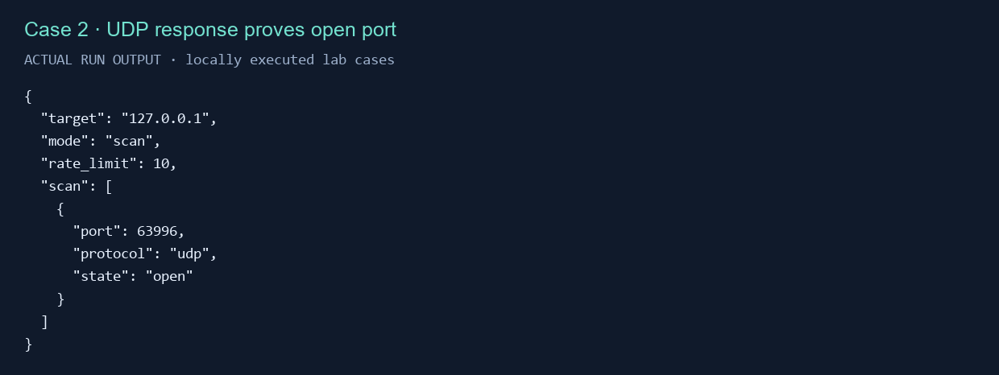

## 5. Banner, dịch vụ, sơ đồ mạng, cấu hình — Case 3

```powershell
python cli.py --target 127.0.0.1 --ports 8000,8001,8022 --mode all
python cli.py --target 127.0.0.1 --ports 8000,8022 --mode service
python cli.py --target 127.0.0.1 --ports 8000 --mode banner
python cli.py --target 127.0.0.1 --ports 8000 --mode vuln
python cli.py --target 127.0.0.1 --mode map
```

HTTP có `Server: NetReconLab/1.0`; SSH-like có `SSH-2.0-NetReconLab_1.0`. Review phát hiện HTTP plaintext và banner phần mềm. NetworkMapper chỉ đọc ARP cache cục bộ; danh sách có thể rỗng hoặc chứa multicast/broadcast và **không phải toàn bộ topology**. Không có khai thác lỗ hổng trong module review.

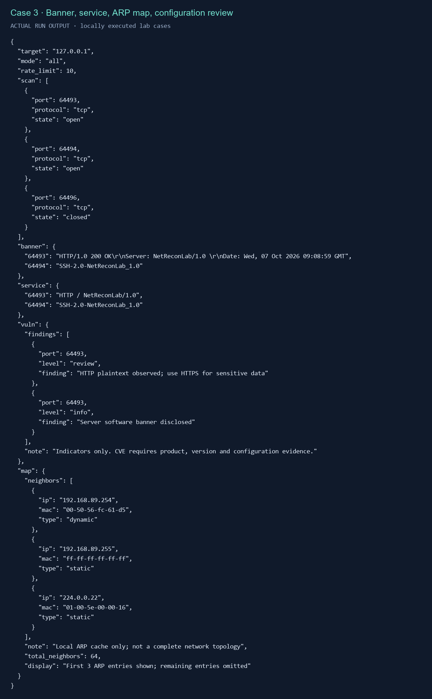

## 6. Whitelist/blacklist, validation, rate limit — Case 4

```powershell
# Blacklist thắng whitelist: bị chặn trước khi probe
python cli.py --target 127.0.0.1 --ports 8000 --mode scan --whitelist 127.0.0.0/8 --blacklist 127.0.0.1
# Input sai: lỗi rõ ràng
python cli.py --target 127.0.0.1 --ports 65536 --mode scan
# Tối đa 5 lần bắt đầu probe mỗi giây
python cli.py --target 127.0.0.1 --ports 8000-8003 --mode scan --rate-limit 5
```

RateLimiter giãn 4 lượt ở 5 probe/giây trong ít nhất khoảng 0,6 giây từ lượt đầu tới lượt cuối. Rate áp dụng các probe do Python khởi tạo trong từng lượt quét, không phải giới hạn tổng mọi gói TCP của hệ điều hành hay tất cả phiên web đồng thời. Giới hạn 256 cổng/lượt.

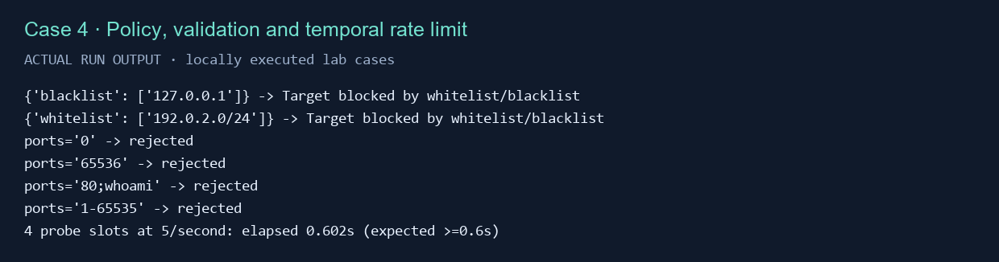

## 7. Web và email — Case 5, 7, 8, 9

```powershell
python app.py
```

Mở [http://127.0.0.1:5000](http://127.0.0.1:5000). Nhập target `127.0.0.1`, ports `8000,8001,8022`, mode `All`, để trống email, bấm **Scan**. Kết quả gồm scan/banner/service/vuln/map. Nhập port `65536` để thử thông báo lỗi HTTP 400.

Nếu 5000 bận: `$env:NETRECON_PORT='5003'`, rồi chạy lại và mở cổng 5003.

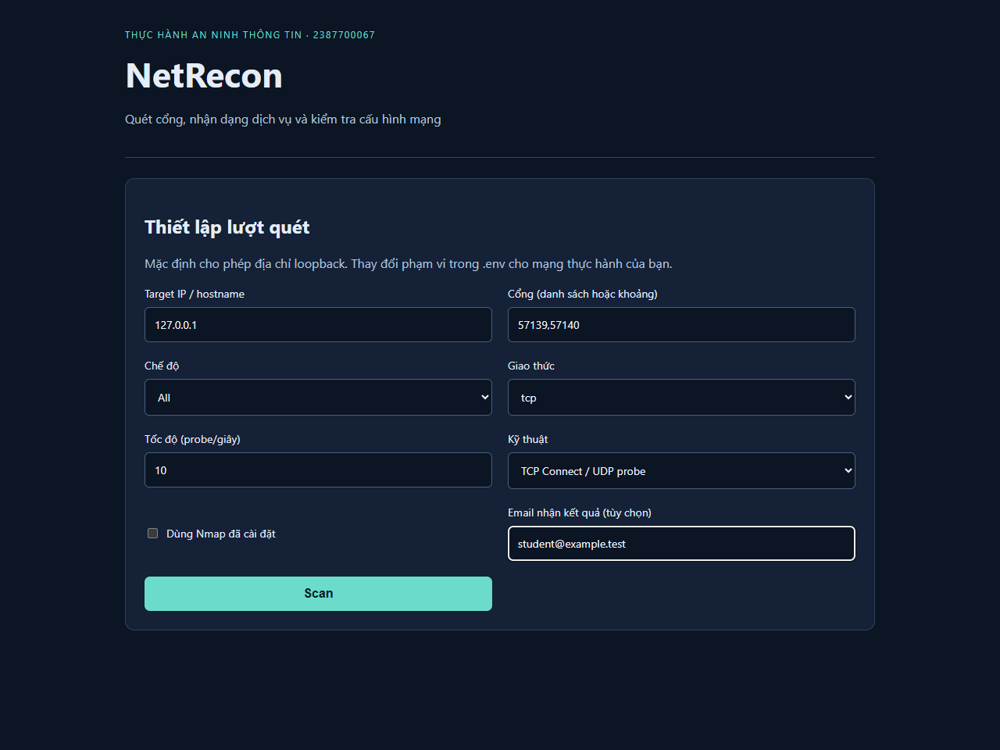

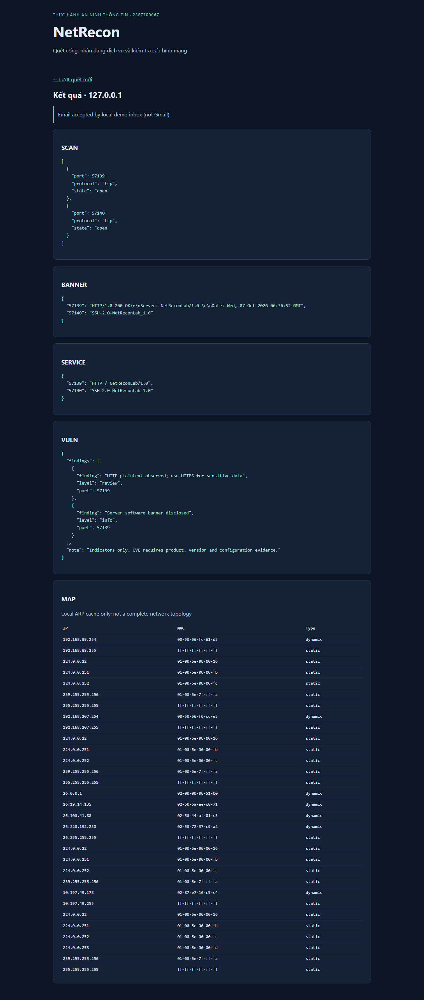

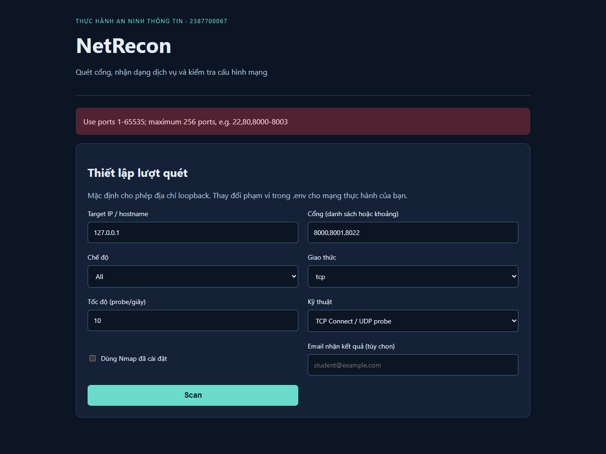

### Email bằng SMTP cục bộ (đã kiểm tra)

Mở terminal khác chạy `python demo_mail.py`. Trong `.env` điền:

```dotenv
SMTP_HOST=127.0.0.1
SMTP_PORT=1025
SMTP_MODE=local
SMTP_USER=netrecon@localhost
SMTP_PASS=
```

Khởi động lại `app.py`, nhập email `student@example.test` rồi Scan. Hộp thư local lưu email vào `demo-inbox.eml`; không gửi ra Internet. Cũng có thể gửi từ CLI:

```powershell
python cli.py --target 127.0.0.1 --ports 8000 --mode all --email student@example.test
```

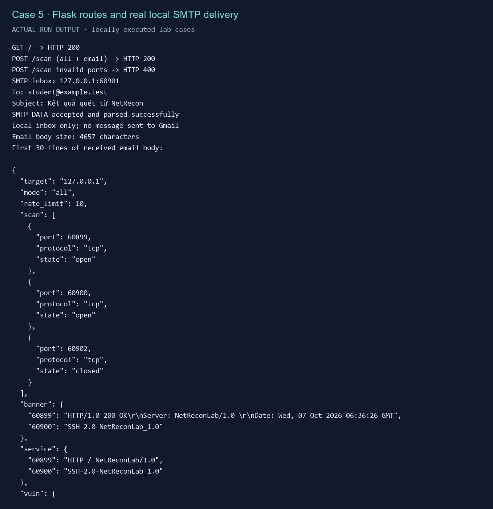

### Email bằng Gmail (bạn cấu hình tài khoản riêng)

Theo [hướng dẫn Google](https://support.google.com/accounts/answer/185833), app password cần tài khoản bật xác minh hai bước; khả năng tạo còn phụ thuộc loại/chính sách tài khoản. Mở [App passwords](https://myaccount.google.com/apppasswords) nếu tài khoản hỗ trợ, tạo mật khẩu ứng dụng và chỉ lưu trên máy trong `.env`:

```dotenv
SMTP_HOST=smtp.gmail.com
SMTP_PORT=465
SMTP_MODE=ssl
SMTP_USER=your-address@gmail.com
SMTP_PASS=your-app-password
```

Khởi động lại app, nhập địa chỉ nhận của bạn và Scan. Thất bại email vẫn hiển thị kết quả scan và thông báo lỗi. **Gửi Gmail chưa được kiểm tra bằng tài khoản thật**; không có ảnh hộp thư Gmail giả lập trong báo cáo. Không sử dụng địa chỉ/mật khẩu xuất hiện trong ảnh giáo trình.

## 8. Log — Case 6

```powershell
Get-Content netrecon.log -Tail 25
```

Có timestamp, START/END, ALLOW/BLOCK, PROBE, BANNER, SERVICE, MAP, VULN và EMAIL khi chức năng tương ứng chạy. File là log cục bộ và được Git bỏ qua. Ảnh này là các dòng thực từ log sau demo:

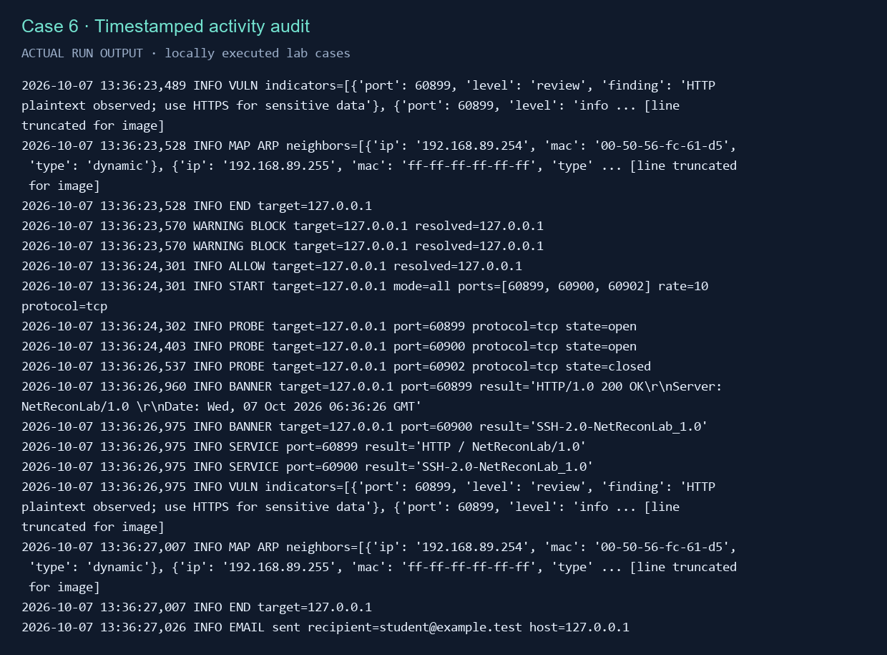

## 9. Nmap và TCP SYN theo yêu cầu giáo trình

Máy hiện tại chưa có `nmap` trong PATH. Phần Python chạy độc lập; muốn kiểm tra Nmap và SYN, cài từ [trang Nmap chính thức](https://nmap.org/download.html), kèm Npcap theo bộ cài Windows, mở terminal mới và kiểm tra `nmap --version`.

```powershell
# Nhận dạng phiên bản bằng Nmap -sT -sV
python cli.py --target 127.0.0.1 --ports 8000,8022 --mode service --nmap
# SYN half-open bằng -sS; dùng terminal có quyền phù hợp/Npcap
python cli.py --target 127.0.0.1 --ports 8000,8022 --mode scan --technique syn --nmap --rate-limit 5
# UDP nhận dạng bằng -sU -sV
python cli.py --target 127.0.0.1 --ports 8053 --mode service --protocol udp --nmap
```

Theo [tài liệu kỹ thuật Nmap](https://nmap.org/book/man-port-scanning-techniques.html), SYN không hoàn tất TCP handshake và có thể cần quyền raw packet/Npcap; kỹ thuật này vẫn có thể bị phát hiện. Wrapper sử dụng [tham số hiệu năng](https://nmap.org/book/man-performance.html) `--max-rate`, `--max-retries`, `--host-timeout` và timeout subprocess. `--max-rate` của Nmap áp dụng quét/discovery, không bảo đảm cùng mức trần cho mọi probe nhận dạng phiên bản. Lỗi thiếu Nmap hoặc thiếu quyền được báo rõ, không giả báo SYN thành công. **Chưa có case Nmap/SYN chạy thật trên máy này**; chụp thêm ảnh khi bạn cài và chạy các lệnh trên.

## 10. Kiểm thử và tái tạo ảnh

```powershell
python -m pytest -q
python demo.py
python capture_web.py
```

Đã chạy: **11 unit test đạt**, **6 nhóm case tích hợp đạt**. `demo.py` tạo fixture TCP/UDP/SMTP trên cổng ngẫu nhiên, kiểm tra CLI bằng subprocess, kiểm tra HTTP bằng Flask test client, đối chiếu email đã nhận qua SMTP socket thật. `capture_web.py` khởi tạo web/fixture, dùng Playwright và Chrome headless để chụp form/kết quả/lỗi; có kiểm tra mobile không tràn ngang. Cài dependency ở `Buoi3/requirements-dev.txt` nếu cần tạo ảnh lại.

PNG case 1–6 được render từ kết quả chạy thật, có `.txt` cùng tên; PNG case 7–9 là screenshot browser thật. Các nội dung đầu ra/port/ARP thay đổi theo mỗi lần chạy. `demo-inbox.eml` chỉ là email demo local, được Git bỏ qua.
